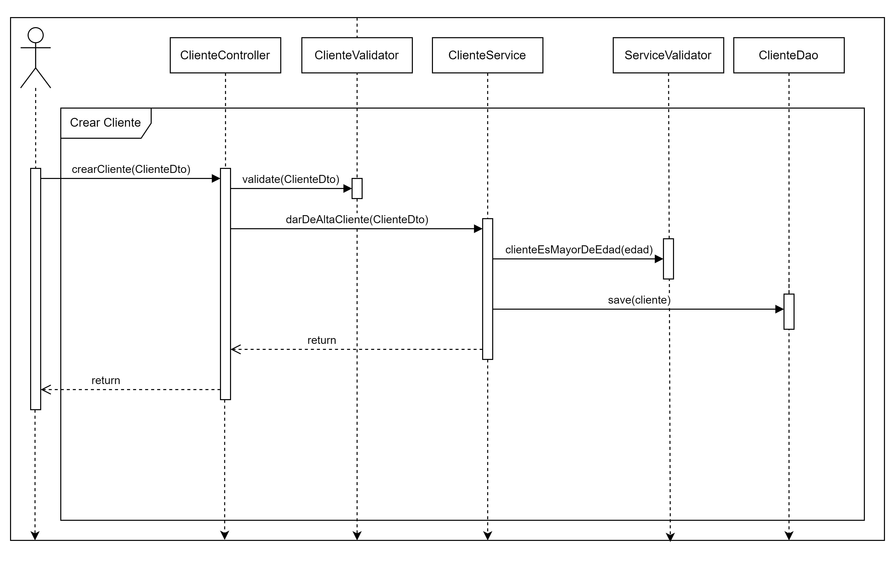
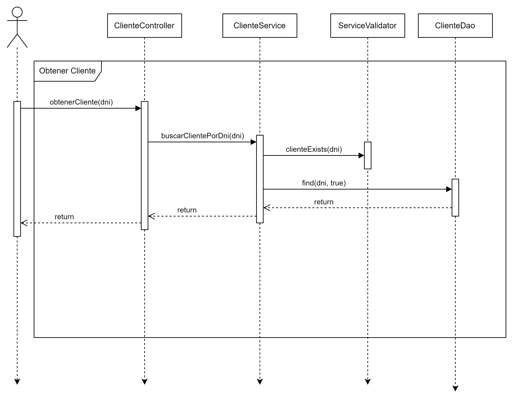
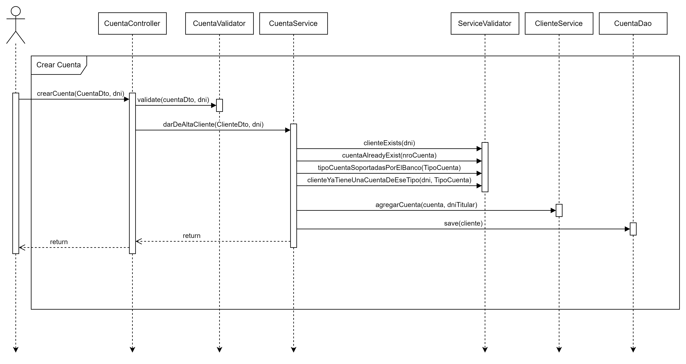
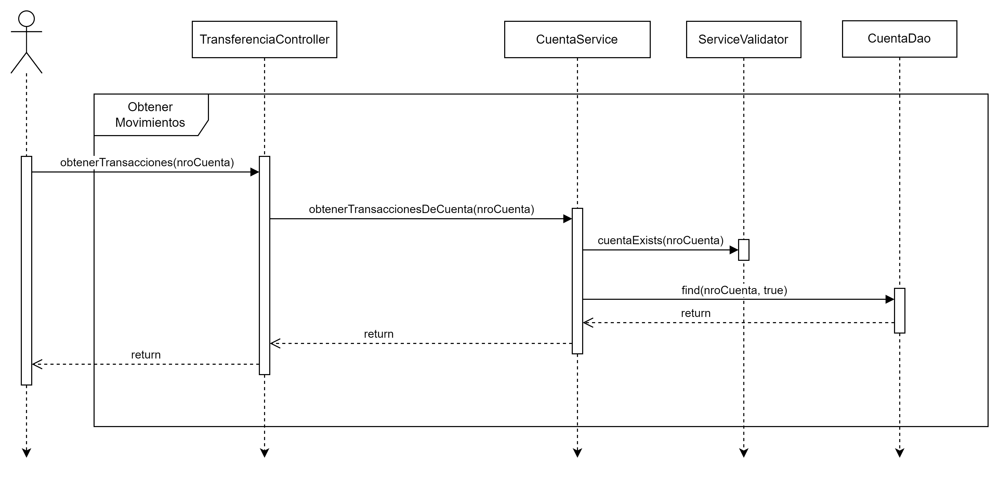
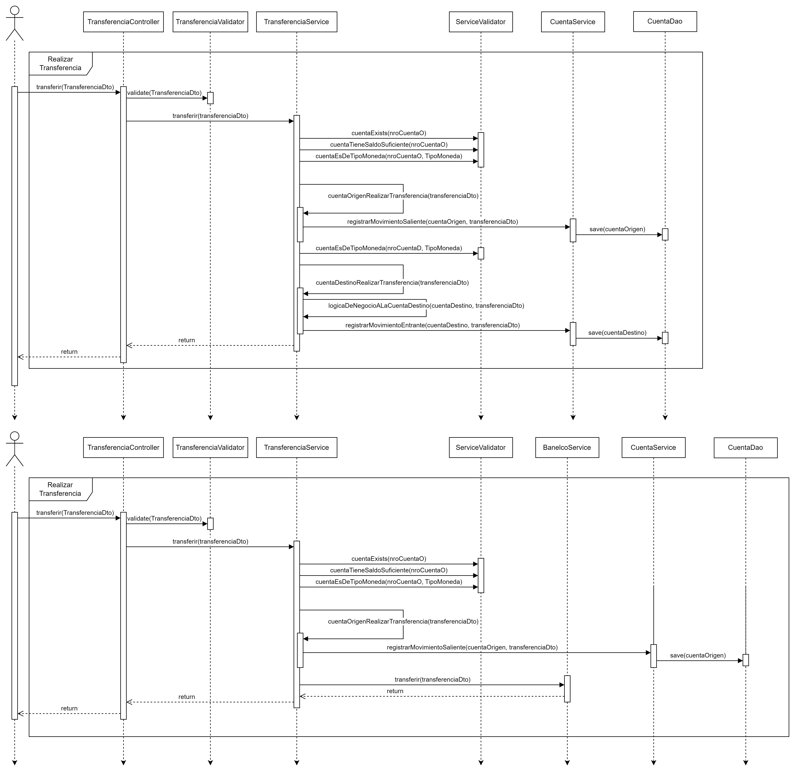
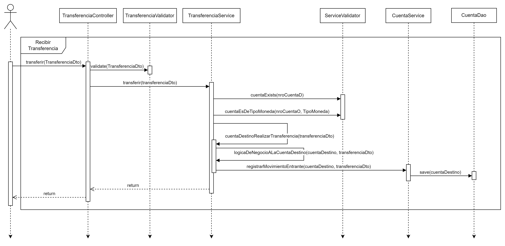

# Proyecto Final: Laboratorio III

Proyecto final de la materia laboratorio 3 de la carrera _Técnicatura Universitaria en Programación_ en la _Universidad Tecnológica Nacional_.


Projecto realizado y entregado el día 12/9/2024.

---

## Usage / Uso

<details>
<summary>
Guide - Guía
</summary>

Java 22 needed.

1. Clone Repo / Clonar repositorio.

```BASH
git clone https://github.com/Matias-Bussetti/tup2024-labo-3-tp-2.git
```

2. Install mvn dependencies / Instalar las dependencias del proyecto maven.

```BASH
mvn install
```

3. Run Project / Ejecutar Proyecto.

```BASH
mvn spring-boot:run
```

4. (Optional) Run test Coverage / Ejecutar tests y covertura de código.

```BASH
mvn verify
```

</details>

---

## Endpoints <small>(only good cases)</small>

<details>
<summary>
Endpoints Cliente
</summary>

- _Controller:_ ClienteController
- _Function:_ crearCliente
- _Path:_ **/cliente**
- _Method:_ **POST**
- _Example Input:_

```JSON
{
    "nombre": "Pepe",
    "apellido": "Días",
    "dni": 43241638,
    "fechaNacimiento": "2001-10-01",
    "tipoPersona": "J",
    "banco": "Banco Centra"
}
```

- _Example Output:_

```JSON
{
    "nombre": "Pepe",
    "apellido": "Días",
    "dni": 43241638,
    "fechaNacimiento": "2001-10-01",
    "tipoPersona": "PERSONA_JURIDICA",
    "banco": "Banco Centra",
    "fechaAlta": "2024-09-12",
    "cuentas": [],
    "edad": 22
}
```

#### Diagram



---

- _Controller:_ ClienteController
- _Function:_ obtenerCliente
- _Path:_ **/cliente**
- _Method:_ **GET**
- _Parameter Example:_ **?dni=43241638**
- _Example Output:_

```JSON
{
    "nombre": "Pepe",
    "apellido": "Días",
    "dni": 43241638,
    "fechaNacimiento": "2001-10-01",
    "tipoPersona": "PERSONA_JURIDICA",
    "banco": "Banco Centra",
    "fechaAlta": "2024-09-12",
    "cuentas": [],
    "edad": 22
}
```

#### Diagram



</details>

---

<details>

<summary>
Endpoints Cuenta
</summary>

- _Controller:_ CuentaController
- _Function:_ crearCuenta
- _Path:_ **/cuenta**
- _Method:_ **POST**
- _Example Input:_

```JSON
{
    "tipoCuenta": "CA$",
    "moneda": "dolares"
}
```

- _Example Output:_

```JSON
{
    "numeroCuenta": 70543343,
    "fechaCreacion": "2024-09-12T15:48:44.6778747",
    "balance": 0.0,
    "tipoCuenta": "CA$",
    "moneda": "DOLARES",
    "movimientos": []
}
```

#### Diagram



---

- _Controller:_ TransferenciaController
- _Function:_ obtenerTransacciones
- _Path:_ **/api/cuenta/{{nroCuenta}}/transacciones**
- _Method:_ **GET**
- _Example Input:_ **/api/cuenta/70543343/transacciones**
- _Example Output:_

```JSON
{
    "numeroCuenta": 70543343,
    "movimientos": []
}
```

#### Diagram



</details>

---

<details>

<summary>
Endpoints Transferencia
</summary>

- _Controller:_ TransferenciaController
- _Function:_ transferir
- _Path:_ **/api/transfer**
- _Method:_ **POST**
- _Example Input:_

```JSON
{
    "moneda": "dolares",
    "cuentaOrigen": 3016092292876861464,
    "cuentaDestino": 98231684651321684,
    "monto": 5000
}
```

- _Example Output:_

```JSON
{
    "estado": "EXITOSA",
    "mensaje": "Se realizo la transferencia"
}
```

#### Diagram (first same bank, case 2 uses banelco service)



---

- _Controller:_ TransferenciaController
- _Function:_ recibirTransferencia
- _Path:_ **/api/receive/transfer**
- _Method:_ **POST**
- _Example Input:_

```JSON
{
    "moneda": "dolares",
    "cuentaOrigen": 3016092292876861464,
    "cuentaDestino": 98231684651321684,
    "monto": 5000
}
```

- _Example Output:_

```JSON
{
    "estado": "EXITOSA",
    "mensaje": "Se realizo la transferencia"
}
```

#### Diagram



</details>

---
